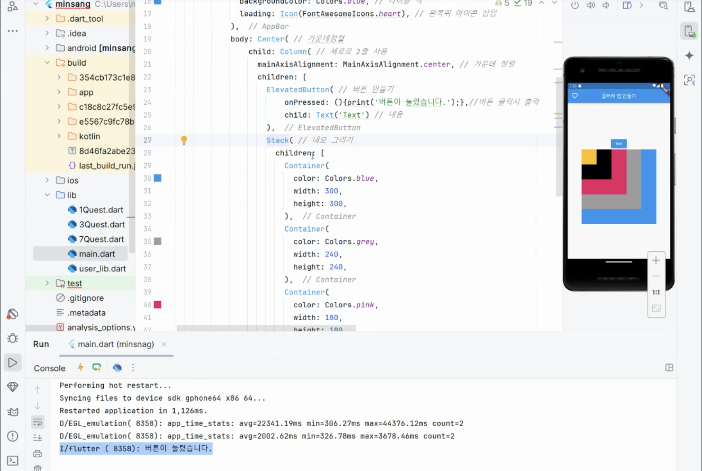
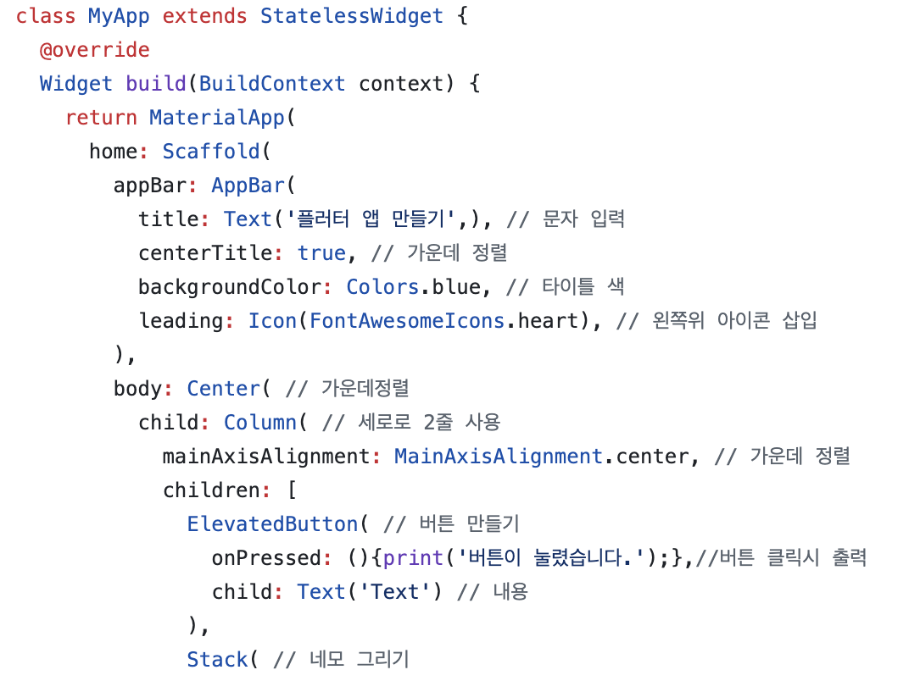
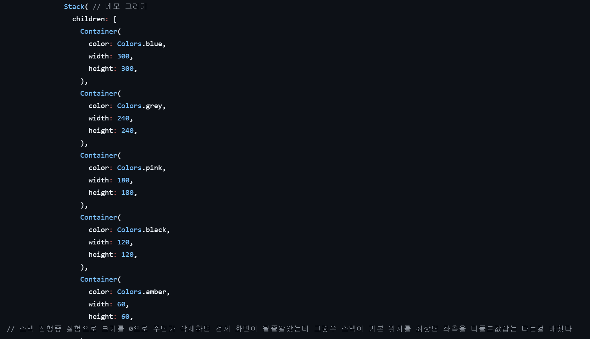
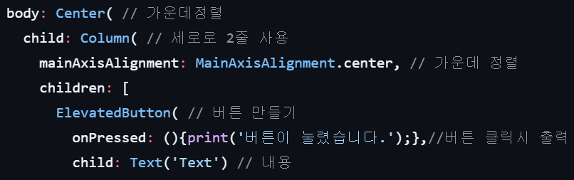

# AIFFEL Campus Online Code Peer Review Templete
- 코더 : 김민상, 최창윤
- 리뷰어 : 이은솔, 강민성


# PRT(Peer Review Template)
- [x]  **1. 주어진 문제를 해결하는 완성된 코드가 제출되었나요?**
    - 문제에서 요구하는 기능이 정상적으로 잘 작동합니다.
    - 
    
- [x]  **2. 전체 코드에서 가장 핵심적이거나 가장 복잡하고 이해하기 어려운 부분에 작성된 
주석 또는 doc string을 보고 해당 코드가 잘 이해되었나요?**
    - 각 코드가 무슨 기능을 하는지, 왜 그렇게 짜여진건지, 작동 메커니즘이 어떻게 되는지가 기술되어 있습니다.
    - 저희팀에서 작성한 코드와 거의 유사하였고, 주석을 보고 코드 이해가 잘 되었습니다.
    - 
        
- [x]  **3. 에러가 난 부분을 디버깅하여 문제를 해결한 기록을 남겼거나
새로운 시도 또는 추가 실험을 수행해봤나요?**
    - 스택을 구현하는 과정에서 실험이 기록되어 있지는 않았지만 주석을 통해 실험을 하였고 어떤 결과가 도출되었는지 확인할 수 있었습니다.
    - 
        
- [x]  **4. 회고를 잘 작성했나요?**
    - 회고를 보고 코더가 어떤 점을 배웠는지 잘 알 수 있었습니다.
    - 
        
- [x]  **5. 코드가 간결하고 효율적인가요?**
    - column을 잘 사용하였고, Alignment를 사용하여 정렬을 훌륭히 하였습니다.
    - 


# 회고(참고 링크 및 코드 개선)
```
- 은솔 : 저희 조가 작성한 코드와 거의 유사하였습니다. 이것저것 코드를 바꾸며 실험해 본 내용을 공유해주셔서 추가적인 내용을 학습할 수 있었습니다.    
- 민성 : 같은 퀘스트를 받았는데 기본적인 틀은 비슷하지만 각자 실험해보고 싶었던 점이 달라서 서로의 실험 내용을 공유하였던 게 재밌었습니다.
```
