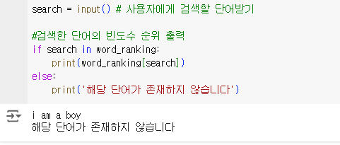
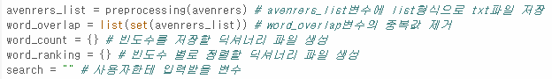
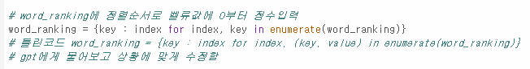
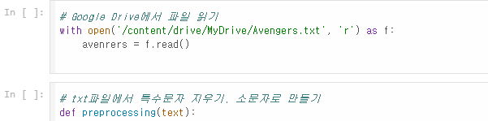

# AIFFEL Campus Online Code Peer Review Templete
- 코더 : 김민상
- 리뷰어 : 이은솔


# PRT(Peer Review Template)
- [ ]  **1. 주어진 문제를 해결하는 완성된 코드가 제출되었나요?**
    - 문제에서 요구하는 최종 결과물이 산출되지 않습니다.
    -  
    
- [x]  **2. 전체 코드에서 가장 핵심적이거나 가장 복잡하고 이해하기 어려운 부분에 작성된 
주석 또는 doc string을 보고 해당 코드가 잘 이해되었나요?**
    - 해당 코드의 기능과 작동 원리를 상세하게 작성하여, 주석을 보고 코드 이해가 잘 되었습니다.
    -  
        
- [x]  **3. 에러가 난 부분을 디버깅하여 문제를 해결한 기록을 남겼거나
새로운 시도 또는 추가 실험을 수행해봤나요?**
    - 문제 원인 및 해결 과정을 기록하였습니다. 
    - 에러가 난 코드에 대해 gpt의 도움을 받아 추가적으로 수행한 시도가 기록되어 있습니다.
    -  
        
- [x]  **4. 회고를 잘 작성했나요?**
    - 프로젝트 결과물에 대해 배운점과 느낀점 등이 기록되어 있습니다.
    - 전체 코드 실행 플로우를 그래프로 그리지는 않았습니다.
    -  
        
- [ ]  **5. 코드가 간결하고 효율적인가요?**
    - 상대적으로 간결하지는 않으나, 범용적으로 사용할 수 있도록 하였습니다.
    - 함수의 영역을 최소화함으로서 코드 수정이 편리하도록 구성하였습니다.
    -  


# 회고(참고 링크 및 코드 개선)
```
# 리뷰어의 회고를 작성합니다.
# 코드 리뷰 시 참고한 링크가 있다면 링크와 간략한 설명을 첨부합니다.
# 코드 리뷰를 통해 개선한 코드가 있다면 코드와 간략한 설명을 첨부합니다.
```
